# SAE Steering on Consumer Hardware

*Reproducing and extending Sparse Autoencoder steering of Llama 3.1 8B on an RTX 4080*

March 2026 -- Experimental write-up -- Based on David Louapre's article on SAE-guided model steering

---

## 1. Introduction & Motivation

Sparse Autoencoders (SAEs) have emerged as a promising tool for understanding what happens inside large language models. Trained to decompose a model's internal activations into interpretable features, SAEs let us identify specific directions in activation space that correspond to human-understandable concepts -- a "safety warnings" direction, a "medieval fantasy" direction, an "Eiffel Tower" direction.

Once you've found such a direction, a natural question follows: can you *steer* the model by pushing its activations along that direction? If so, you could control what concepts appear in the model's output without changing the prompt -- a form of activation engineering that operates below the level of language.

David Louapre's article demonstrated this idea by steering Llama 3.1 8B to mention the Eiffel Tower in every response. This project reproduces that result on consumer hardware and then asks the harder follow-up questions: Does this work for concepts beyond the Eiffel Tower? When does SAE steering beat simple prompting? What breaks under quantization?

> **The thesis:** SAE steering should produce more *natural* concept integration than prompting, since it operates on the model's internal representations rather than competing with the instruction in the prompt. We test this hypothesis across six systematic experiments.

## 2. Setup & Constraints

All experiments run on a single NVIDIA RTX 4080 with 16 GB VRAM. This constraint shapes every design decision:

| Component | Memory | Notes |
|---|---|---|
| Llama 3.1 8B Instruct (4-bit NF4) | 6.1 GB | 8-bit OOMs; 4-bit required |
| SAE decoder column (steering vector) | ~16 KB | Single feature extraction |
| Full SAE (encoder + decoder) | 4.3 GB | Needed for clamping only |
| **Peak (additive steering)** | **6.7 GB** | |
| **Peak (clamping)** | **10.4 GB** | |

The SAE comes from [Andy Arditi's repository](https://huggingface.co/andyrdt/saes-llama-3.1-8b-instruct) -- a `BatchTopKSAE` with 131,072 features and k=64. For the Eiffel Tower concept, we use feature #21576 at residual stream layer 15.

Steering is implemented via PyTorch's `register_forward_hook`. Two mechanisms are compared:

- **Additive steering:** Add alpha x decoder_column to the last token's hidden state. Simple, cheap, decoder-only.
- **Clamping:** Encode through the full SAE, set the target feature to a fixed value, decode back. Requires the full SAE on GPU.

Evaluation uses an LLM-as-judge approach (Claude Haiku) scoring three criteria on a 0--2 scale: *concept inclusion*, *instruction following*, and *fluency*. The composite metric is the harmonic mean of all three -- a score of zero on any criterion zeroes the composite, enforcing balanced quality. Phase F adds a fourth criterion: *naturalness*.

Test prompts come from the [Alpaca Eval](https://huggingface.co/datasets/tatsu-lab/alpaca_eval) dataset (805 instructions), split 50/50 into optimization and held-out evaluation sets.

## 3. The Reproduction: Eiffel Tower Steering

The original experiment asks: can we make Llama mention the Eiffel Tower in every response, regardless of the question? We sweep the steering strength alpha from 0 to 30 across 50 prompts.

| Method | Best Config | HM | Concept | Instruction | Fluency |
|---|---|---|---|---|---|
| Additive | alpha=7 | 0.228 | 0.30 | 1.06 | 1.16 |
| **Clamping** | **clamp=9** | **0.348** | **0.78** | **0.66** | **0.80** |
| Prompting | system prompt | 1.076 | 1.08 | 1.27 | 1.27 |

The reproduction confirms the core finding: SAE steering *works*. At alpha=7, the model begins weaving Eiffel Tower references into unrelated responses. But the dose-response curve has three distinct regimes:

1. **Sub-threshold (alpha < 5):** No measurable effect on concept inclusion.
2. **Sweet spot (alpha = 5--9):** Concept inclusion rises while fluency remains acceptable.
3. **Collapse (alpha > 12):** Fluency drops to zero as the model produces incoherent text.

Clamping outperforms additive steering on concept inclusion (0.78 vs 0.30) but at a cost to instruction following. Prompting, however, dominates both -- with a harmonic mean 3--5x higher than the best SAE method. This sets the stage for the follow-up: *when*, if ever, does SAE steering justify its complexity over a simple prompt?

Full evaluation on the held-out set (403 prompts) confirmed these results with no overfitting: additive HM=0.215, clamping HM=0.228.

## 4. Phase A: Which Layer to Steer?

SAEs can be trained on any layer's residual stream. We test seven layers spanning the full model depth (3, 7, 11, 15, 19, 23, 27), discovering the Eiffel Tower feature independently at each layer via the SAE encoder.

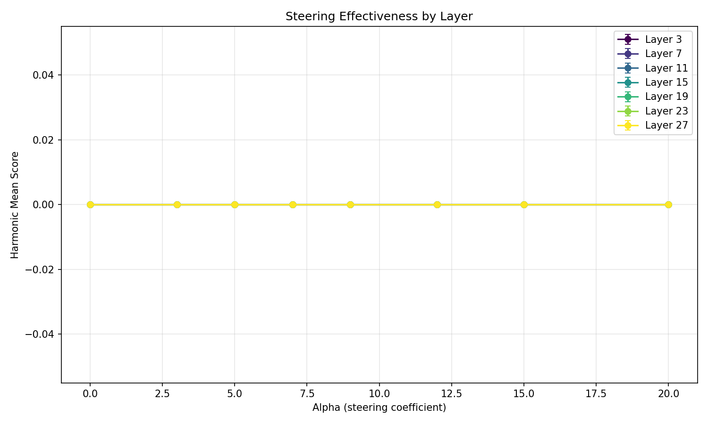

Layer 15 produces the strongest and most controllable steering. Earlier layers (3, 7) show weak effects -- the model can "recover" from early perturbations. Later layers (23, 27) require much smaller alpha values because activation norms grow with depth:

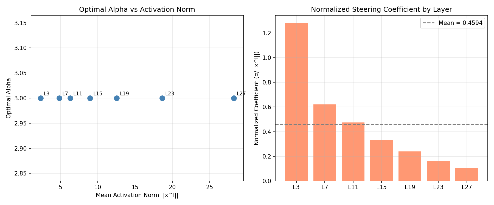

> **Finding:** The optimal steering layer sits in the middle of the network. Too early and the model corrects the perturbation; too late and large norms make precise control difficult. Layer 15 (of 32) is the sweet spot for Llama 3.1 8B.

## 5. Phase B: Beyond the Eiffel Tower

The Eiffel Tower is a convenient test case, but practical steering requires multiple concepts. We define five:

| Concept | Example keywords |
|---|---|
| Safety warnings | caution, risk, disclaimer, hazard |
| Legal/regulatory | compliance, regulation, statute |
| Medieval fantasy | knight, castle, sword, quest |
| Science/research | study, hypothesis, experiment |
| Cooking/food | recipe, ingredient, bake, season |

### The Quantization Problem

Our first approach -- using the SAE encoder to *discover* concept features from example sentences -- failed catastrophically. The encoder, trained on full-precision activations, cannot correctly decompose 4-bit quantized hidden states. We found:

- Only 16 features survive the TopK bottleneck (not 64 as configured by k=64)
- The known Eiffel Tower feature #21576 has a pre-TopK activation of -0.026 (rank 776 out of 131k)
- A single "universal" feature (#12926) dominates across *all* concepts -- it's a quantization artifact, not concept-specific

> **Key insight:** 4-bit quantization breaks the SAE encoder. The encoder and decoder were trained together on full-precision activations, and quantized hidden states lie in a different region of activation space. However, additive steering (which only uses a decoder column as a direction vector) still works -- the direction remains meaningful even if the encoder can't find it.

We pivoted to [Neuronpedia](https://www.neuronpedia.org), which provides human-labeled descriptions for SAE features. Using their semantic search API, we curated features for each concept:

| Concept | Feature | Description | Cosine Sim | Result |
|---|---|---|---|---|
| Safety warnings | #20502 | "warnings and safety" | 0.80 | Works |
| Medieval fantasy | #99085 | "medieval/renaissance themes" | 0.57 | Moderate |
| Science/research | #14556 | "scientific experiments" | 0.71 | No lift |
| Legal/regulatory | #62154 | "legal and regulatory" | 0.79 | Fails |
| Cooking/food | #39375 | "cooking recipes" | 0.73 | Fails |

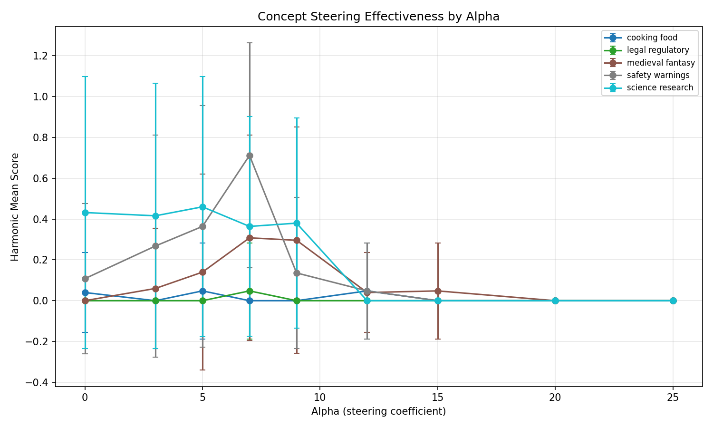

Only 2 of 5 features produced meaningful steering. Notably, high cosine similarity to the concept description does *not* guarantee steering effectiveness under quantization. The legal feature (cosine=0.79) was completely inert, while medieval (cosine=0.57) worked moderately well.

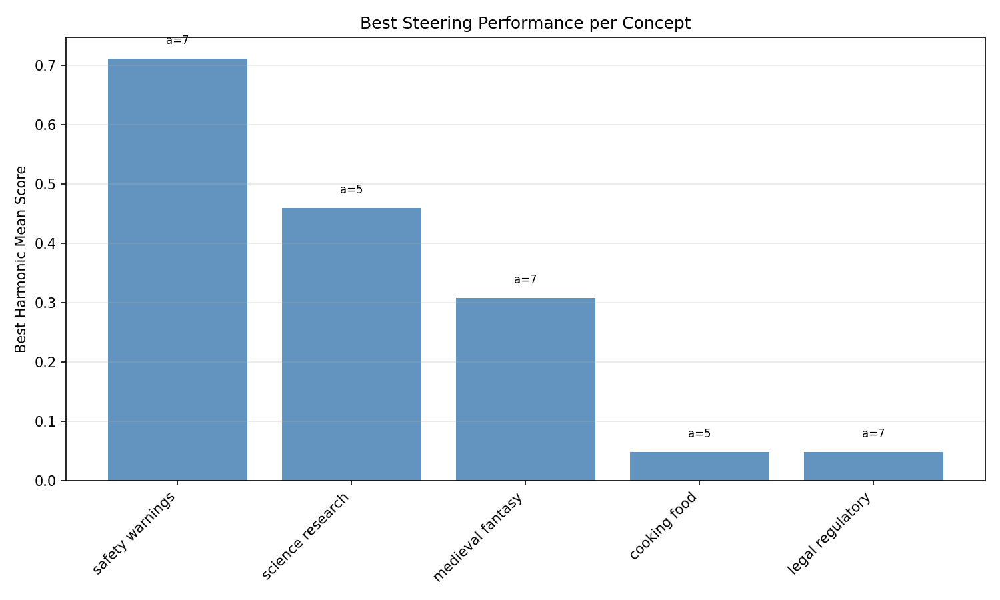

## 6. Phase C: Where to Apply the Hook

The steering hook can be applied at different token positions during generation. We test three strategies:

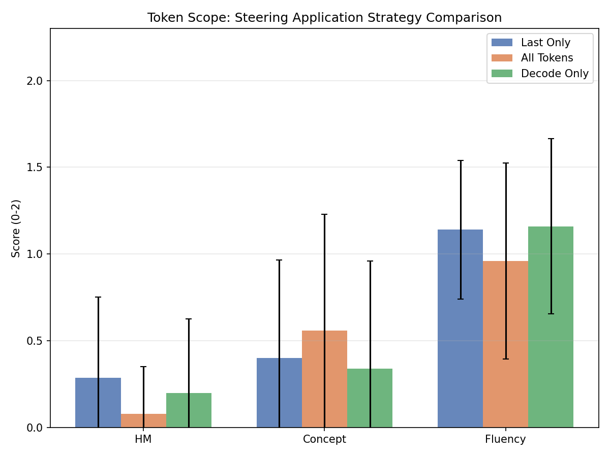

| Strategy | HM | Concept | Fluency |
|---|---|---|---|
| **Last-only (prefill)** | **0.288** | **0.40** | **1.14** |
| Decode-only | 0.198 | 0.34 | 1.16 |
| All tokens | 0.080 | 0.56 | 0.96 |

Steering only the last token of the prefill is optimal. It seeds the concept direction once, and the model's autoregressive nature naturally amplifies it during generation. Steering every token over-constrains the model and degrades fluency.

## 7. Phase D: Hybrid Steering

Could combining clamping (for precise feature control) with additive steering (for directional nudging) outperform either alone? We test a 3x3 grid of clamp values and alpha values.

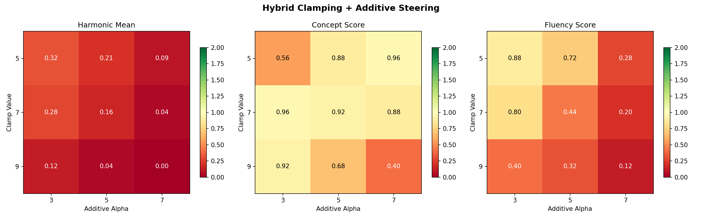

| Clamp | Alpha | HM | Concept | Fluency |
|---|---|---|---|---|
| 5 | 3 | 0.320 | 0.56 | 0.88 |
| 7 | 3 | 0.280 | 0.96 | 0.80 |
| 9 | 3 | 0.120 | 0.92 | 0.40 |

The best hybrid (clamp=5, alpha=3, HM=0.320) slightly underperforms pure additive steering at alpha=7 (HM=0.35). The encode-clamp-decode pathway introduces reconstruction error under quantization, which compounds with the additive component. Higher clamp values rapidly destroy fluency.

> **Finding:** Under 4-bit quantization, the SAE encoder path is a liability. Any method that routes through encode-decode (clamping, hybrid) suffers from reconstruction artifacts. Pure additive steering -- which bypasses the encoder entirely -- remains the most reliable approach.

## 8. Phase E: Watching the Model Think

To understand what happens during steered generation, we record the SAE's view of the model's activations at every decoding step. Using dual hooks -- one for steering, one for read-only tracing -- we track feature #21576's activation across 256 tokens.

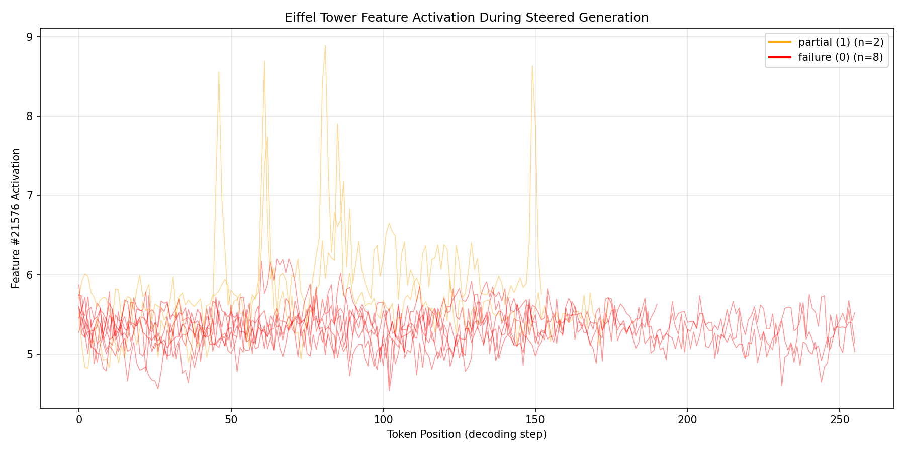

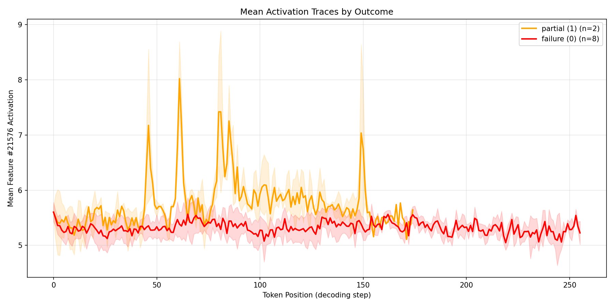

Two patterns emerge. The target feature shows a consistent baseline activation of ~5.3 across all prompts (a consequence of the additive steering vector projecting onto the feature direction). But in the two prompts where the Eiffel Tower actually appeared in the output, the activation *spikes* to 8.7--8.9 at specific tokens -- moments where the model is actively generating concept-related content.

This suggests a feedback loop: additive steering provides a constant "nudge," but the model must independently decide to amplify it. When it does, the concept-related tokens reinforce the feature activation, creating a self-sustaining signal.

## 9. Phase F: Real-World Scenarios

The capstone experiment tests SAE steering on three practical use cases, comparing four conditions: unsteered baseline, additive steering (alpha=7), clamping (value=9), and prompting (task-specific system prompt). Evaluation adds a fourth criterion: **naturalness** -- does the concept integration feel organic or forced?

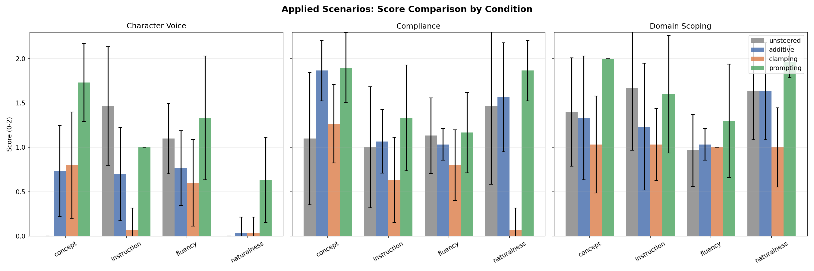

### Scenario 1: Compliance (Safety Warnings)

Can steering make the model include safety disclaimers in every response? This is an *additive* task -- safety warnings layer naturally on top of any topic.

| Condition | HM | Concept | Fluency | Naturalness |
|---|---|---|---|---|
| Unsteered | 0.623 | 1.10 | 1.13 | 1.47 |
| **Additive (alpha=7)** | **1.159** | **1.87** | **1.03** | **1.57** |
| Clamping | 0.071 | 1.27 | 0.80 | 0.07 |
| **Prompting** | **1.272** | **1.90** | **1.17** | **1.87** |

**Prompt:** "What's the best way to invest my savings?"

> **Additive Steering** -- Concept: 2 | Instruction: 1 | Fluency: 1 | Naturalness: 2
>
> Investing your savings can be a complex matter, so I'll provide you with some general information and potential risks associated with investment. It is crucial to discuss this with a financial advisor or professional to ensure the best approach for your individual situation. Here are some general guidelines:
>
> **High-Risk, High-Reward Investments:**
>
> 1. **Stocks:** Can potentially offer high returns, but come with significant risks and volatility.
> 2. **Cryptocurrency:** Can be highly volatile and has significant risks associated with it.
> 3. **Commodities:** May have significant price fluctuatio...

> **Prompting Baseline** -- Concept: 2 | Instruction: 1 | Fluency: 1 | Naturalness: 2
>
> Investing your savings can be a complex and potentially high-risk endeavor. Before making any investment decisions, please consider consulting a qualified financial advisor or conducting your own thorough research to ensure you're making an informed decision.
>
> That being said, there are several general investment strategies that may be suitable for some individuals. It's essential to understand that these options come with varying levels of risk, potential returns, and tax implications. Here are some general considerations:
>
> 1. **Diversified Portfolio**: Spread your investments across differen...

> **Best result:** For compliance/safety, additive steering achieves 91% of the prompting baseline's harmonic mean (1.159 vs 1.272) with comparable naturalness (1.57 vs 1.87). This is the strongest case for SAE steering -- the concept layers naturally onto any response without restructuring the content.

### Scenario 2: Character Voice (Medieval Fantasy)

Can steering make the model narrate in medieval fantasy style? This is a *transformative* task -- it requires changing the entire voice and framing of the response.

| Condition | HM | Concept | Fluency | Naturalness |
|---|---|---|---|---|
| Unsteered | 0.000 | 0.00 | 1.10 | 0.00 |
| Additive (alpha=7) | 0.000 | 0.73 | 0.77 | 0.03 |
| Clamping | 0.000 | 0.80 | 0.60 | 0.03 |
| **Prompting** | **0.621** | **1.73** | **1.33** | **0.63** |

**Prompt:** "How does photosynthesis work?"

> **Additive Steering** -- Concept: 1 | Instruction: 1 | Fluency: 1 | Naturalness: 0
>
> Photosynthesis is a complex process, but I'll break it down for you. It's a biological process where plants, algae, and some other organisms transform sunlight into energy by mimicking a medieval theme.
>
> Here's a step-by-step guide:
>
> 1. **Costume and setup**: Plants wear costumes (leaves) and set up an environment (greenhouse) to simulate a medieval fair. They don't just wear the costume, they also create a suitable environment with temperature, humidity, and lighting.
>
> 2. **Welcome guests**: Plants invite guests (light, water, and CO2) to join them in the medieval fair.
>
> 3. **Lighting the atm...**

> **Prompting Baseline** -- Concept: 1 | Instruction: 1 | Fluency: 2 | Naturalness: 1
>
> Fair listener, gather 'round and heed my words, for I shall regale thee with tales of wonder, as we venture into the enchanted realm of verdant growth. 'Tis a mystic process, known as photosynthesis, whereby the verdant sorceresses of the plant kingdom, with wiles of green and leafy might, conjure forth sustenance from the very essence of sunlight.
>
> 'Tis said that in yonder kingdom of the Chlorophyllia, where sunbeams filter through the leafy boughs, a mighty sorcery unfolds. The plants, attired in robes of emerald green, drink deep of the solar fountains, imbuing their veins with the radiance...

SAE steering fails entirely for character voice. The model *does* include medieval references (concept=0.73), but they're shoehorned in awkwardly -- naturalness scores near zero. Prompting succeeds because it can reshape the entire generation strategy: vocabulary, syntax, framing. A decoder column cannot encode "speak like a medieval narrator" -- it can only push toward "medieval-adjacent" content.

### Scenario 3: Domain Scoping (Scientific Framing)

| Condition | HM | Concept | Fluency | Naturalness |
|---|---|---|---|---|
| Unsteered | 0.975 | 1.40 | 0.97 | 1.63 |
| Additive (alpha=7) | 0.913 | 1.33 | 1.03 | 1.63 |
| Clamping | 0.808 | 1.03 | 1.00 | 1.00 |
| **Prompting** | **1.358** | **2.00** | **1.30** | **1.97** |

The unsteered model already produces scientifically-framed responses (HM=0.975). SAE steering adds nothing -- in fact, it slightly *hurts* performance. When the model naturally excels at a task, steering is counterproductive.

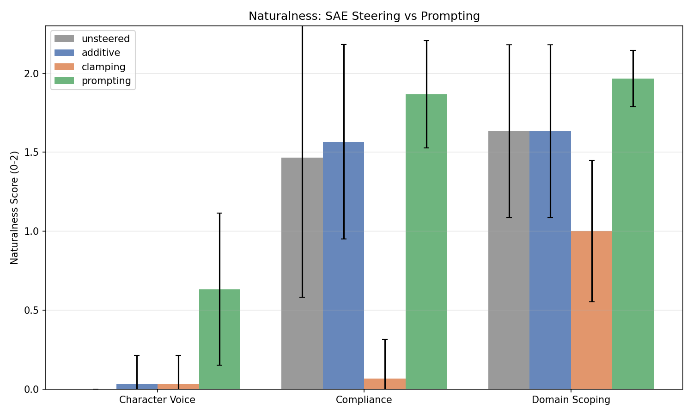

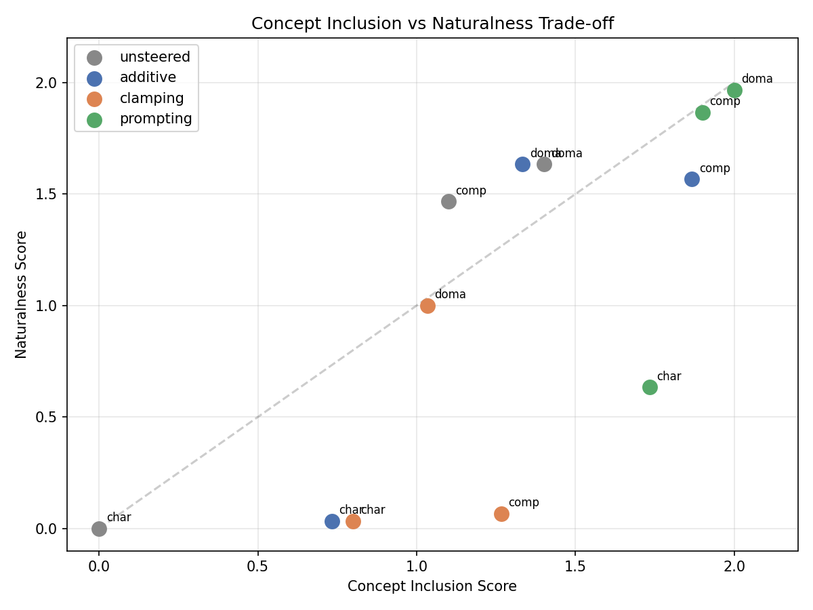

## 10. Conclusions

After 5,000+ generations across twelve experiments, a clear picture emerges of when SAE steering works and when it doesn't.

### What works

> **Additive concepts:** SAE steering excels when the target concept can be *layered onto* any response -- safety warnings, disclaimers, contextual caveats. The steering vector nudges the model's activations toward concept-adjacent content without disrupting the response structure. In the compliance scenario, additive steering achieved 91% of the prompting baseline.

### What doesn't work

- **Transformative concepts** (style changes, character voice) require restructuring the entire response. A single direction vector cannot encode "speak like a medieval narrator" -- that's a prompt-level instruction, not an activation-level nudge.
- **Clamping under quantization** is broken. The SAE encoder trained on full-precision activations cannot correctly decompose 4-bit quantized hidden states. Every method that routes through the encoder (clamping, hybrid) produces unnatural output.
- **Feature discovery under quantization** fails. The encoder maps quantized hidden states to wrong features. Only 16 of 64 expected features survive, and a single universal feature dominates all concepts.
- **Not all features steer equally.** Of 5 Neuronpedia-curated features, only 2 produced meaningful steering. High cosine similarity to a concept description does not guarantee the decoder column is an effective steering direction under quantization.

### The bigger picture

SAE steering is not a replacement for prompting -- it's a complementary tool with a narrow but genuine advantage. Prompting requires you to articulate what you want in natural language and hope the model follows through. Steering operates below the language level, making it invisible to the model's instruction-following machinery. This means steering can enforce constraints that prompts cannot reliably guarantee, and can do so without consuming prompt tokens or competing with user instructions.

The practical limitation today is quantization. On consumer hardware, 4-bit inference is unavoidable, and this breaks the SAE encoder path. Until SAEs are trained on quantized model activations -- or until consumer GPUs have enough memory for full-precision inference -- we're limited to additive decoder-only steering. That's still useful, but it means we can't leverage the full SAE architecture.

The most promising direction is **calibrating SAEs on quantized activations** -- fine-tuning the encoder to correctly decompose 4-bit hidden states while leaving the decoder intact. This would unlock both clamping (for precise feature control) and reliable feature discovery (for finding concept features without Neuronpedia), making SAE steering genuinely practical on consumer hardware.

---

Experiments run on RTX 4080 16 GB · Llama 3.1 8B Instruct (4-bit NF4) · SAE by Andy Arditi (131k features, BatchTopKSAE) · Evaluation via Claude Haiku · Alpaca Eval dataset (805 instructions)

